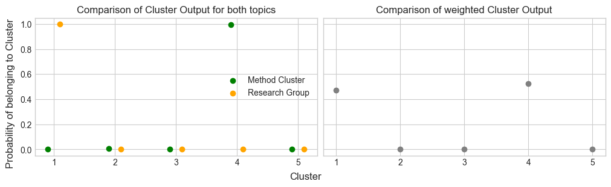

<br>

ByteMe
================

<!-- include logo -->


Match researchers/participants with each other based on their research interests.

`app.py` is the main file. It contains the Flask app and the routes. 

See the `templates/` folder for the HTML templates.

## Getting Started

1. Create `.env` file in the root directory with the following content:

```bash
APP_NAME='byteme'
FLASK_SECRET='Your Secret' 
PORT='8080'                 # or any other port
DEBUG='True'                # or False
```

2. Run the following commands:
```bash
# install dependencies
$ python3 -m venv venv
$ source venv/bin/activate
$ pip install -r requirements.txt
# run the app
$ python3 app.py
```

Visit http://localhost:8080/ to view the app.


## About:
This app is a project for the [Summer Institute in Computational Social Science](https://sicss.io/2023/munich/) 2023 in Munich.
It aims to facilitate the matching of researchers/participants with each other based on their research interests for the group projects.

### 1. General Information

In this notebook, I quickly outline the model on which the recommendations are made. To begin with, data is stored in `~/data/data.csv` and comprises the following categories:
-   Research Questions: A list of `k` proposed questions answered by `n` participants $\in$ {0,1}
-   Method Preferences: A list of `i` proposed methods answered by `n` participants $\in$ {0,1}
-   Main Preference: An indicator answered by `n` participants of wether they regard Methods (0) or Research Question (1) as more important in their project $\in$ (0,1)
-   Desired Scope of the project: An indicator answered by `n` participants of how much effort they want to put in the project $\in$ (0,1)
All relevant code for the analysis is implemented in `Recommender` of *recommend.py* which will be imported first.


```python
from recommend import Recommender
```

When initialising the model, one can choose either to use *simulated data* or the *generated one* (if it exists) by with the `sim`-parameter.


```python
model = Recommender(sim=True)
```

### 2. The Model


For classifying the participant into a fixed number of groups (adjustable with the `cluster_size k`), we opted for two **Bernoulli Mixture Models** which clustered participants independently based on the preferences regarding:
1.  Research Question as $(n \times k)$ matrice $X_1$
2.  Method Preferences as $(n \times i)$ matrice $X_2$

An application of such models is illustrated by [Pierre G. B. Moutounet-Cartan](https://arxiv.org/abs/2005.02931). While skipping most of the important notation and theory, we build the following model twice - for both of the matrices - and use Bayesian inference to get our parameters of interest:
1.  Priors:
    $$P_{ij} \sim Beta(0.5,0.5)$$
    $$R_{ij} \sim Dirichlet_k(e^{-5})$$
    $$Z_n | R_{ij} \sim Categorical_k(R)$$
2.  Likelihood:
    $$X_{in} | P_{ij},Z_n \sim Bernoulli(P_i,Z_n)$$
3.  Posterior: This quantity can be obtained by using Bayes Theorem:
    $$P(X|Y)=\frac{P(Y|X)\cdot P(X)}{P(Y)}$$


```python
result = model.fit(cluster_size=5)
```

### 3. Plots explaining the grouping procedure

As a result of the model, for each participant **i** we get a probability, that he/she belongs to a certain cluster **c**. Since we build two models for Research- and Methods interests independently, we therefore get $10$ probabilities for each participant as illustrated below in the left graph.

For aggregating the models, we make use of the preference indicator mentioned at the beginning indicating weather a participant favours methodological or research-related activities overall. Based on this information, we weighted the cluster probabilities for each participant. For some participants, this procedure resulted in changing preferences, while for others no changes could be observed. You can modify the `person` argument to look at results for individual participants.


```python
model.explainProbabilities(person=12)
```


    

    


The next graph shows the same information as dicussed above, only for all participants aggregated. In the best case, some clusters can already be identified here.


```python
model.plotProbabilites()
```


    

    


Next, we turn to the final variable of interest being the desired Scope of the project. The boxplot below illustrates the preferences of all participants. Up to this point however, it does not contribute to the similarity group forming since we were not sure how to best include this information in the procedure so far. 

Hence, we implemented a second group forming procedure mainly based on this measure in a later stage.


```python
model.plotEffort()
```


    

    


### 4. Creating the Groups

We opted for three different procedures which can be used for creating the respective groups. All three will be outlined in the following:

The first groups are created on the basis of the similarity measures we calculated on the basis of models. Withe the `group_size`-parameter, one can adjust the desired number of groups and in the code, there is also the possibility to change the minimum/maximum number of participants within each of the groups:


```python
model.recommend(kind="similar", group_size=5)
```


    {'Group 1': [12, 15, 6, 28, 19, 14, 25, 4, 7],
     'Group 2': [18, 27, 5, 13, 2, 17, 24],
     'Group 3': [16, 23, 10, 21, 3],
     'Group 4': [8, 29, 20, 9],
     'Group 5': [26, 1, 0, 11, 22]}


The second groups recommendations are based on the desired project scope. Therefore, we divided all participants answers into a fixed number of buckets determinded by `group_size` and made the group allocation accordingly.


```python
model.recommend(kind="motivation", group_size=5)
```


    {'Group 1': array([ 0,  5, 14, 21, 22, 24]),
     'Group 2': array([ 1,  4,  6,  7, 20, 28]),
     'Group 3': array([ 2, 12, 13, 18, 25, 29]),
     'Group 4': array([ 3, 10, 11, 15, 19, 23]),
     'Group 5': array([ 8,  9, 16, 17, 26, 27])}


Finally, there is also the possibility to create groups entirely randomly, where the `group_size`-parameter decides how many groups will be created.


```python
model.recommend(kind="random", group_size=6)
```


    {'Group 1': array([ 5, 10, 23, 15, 27, 24]),
     'Group 2': array([14, 20,  1, 18,  4, 12]),
     'Group 3': array([ 9, 11, 19, 22, 17, 21]),
     'Group 4': array([13,  7, 26,  2,  0, 29]),
     'Group 5': array([16,  8, 25,  3, 28,  6])}


## Contributors
Tilman Kerl & Anton Lechuga, Phelia Weiss, Dylan Paltra, Johanna Klapproth, Johanna Mehltretter, Sammie Douglas, Max Haag, Birgit Zeyer-Gliozzo, ...

## LICENSE: MIT License

Copyright 2023 Tilman Kerl & Anton Lechuga, SICSS Munich 2023

Permission is hereby granted, free of charge, to any person obtaining a copy of this software and associated documentation files (the “Software”), to deal in the Software without restriction, including without limitation the rights to use, copy, modify, merge, publish, distribute, sublicense, and/or sell copies of the Software, and to permit persons to whom the Software is furnished to do so, subject to the following conditions:

The above copyright notice and this permission notice shall be included in all copies or substantial portions of the Software.

THE SOFTWARE IS PROVIDED “AS IS”, WITHOUT WARRANTY OF ANY KIND, EXPRESS OR IMPLIED, INCLUDING BUT NOT LIMITED TO THE WARRANTIES OF MERCHANTABILITY, FITNESS FOR A PARTICULAR PURPOSE AND NONINFRINGEMENT. IN NO EVENT SHALL THE AUTHORS OR COPYRIGHT HOLDERS BE LIABLE FOR ANY CLAIM, DAMAGES OR OTHER LIABILITY, WHETHER IN AN ACTION OF CONTRACT, TORT OR OTHERWISE, ARISING FROM, OUT OF OR IN CONNECTION WITH THE SOFTWARE OR THE USE OR OTHER DEALINGS IN THE SOFTWARE.
